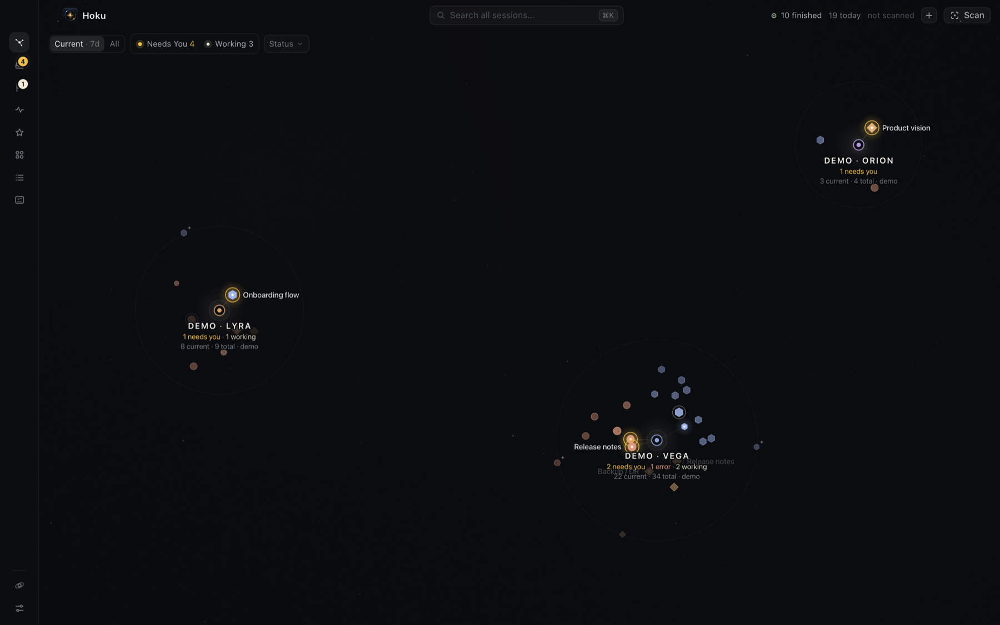
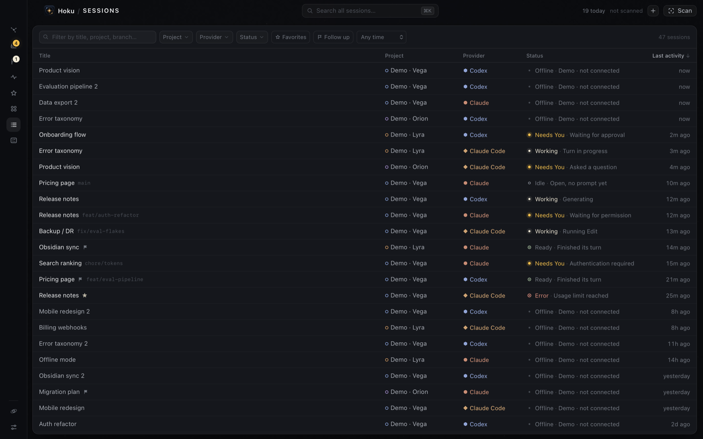

# Hoku

**Your AI work, mapped.**

A local macOS cockpit for AI work that's scattered across Claude Code terminals, Codex
Desktop threads and Claude Desktop conversations. It organizes them as **projects → sessions**
on a constellation map, finds any of them with ⌘K, and takes you back to the exact
conversation in its native tool.



Hoku keeps your AI work spatial and calm: projects remain familiar on the Galaxy while
sessions, runtime state and attention flow stay searchable and manageable.

> **Hoku does not replace Claude or Codex. It indexes and launches sessions in
> their native tools.**



**Platform:** macOS only (developed on Apple Silicon). Linux and Windows are not supported:
opening sessions relies on AppleScript, iTerm/Terminal and macOS app bundles. Hoku is pre-1.0.
Releases are built for Apple Silicon Macs; on an Intel Mac, [build it from source](#running).

## Installing

Hoku is published on [GitHub Releases](https://github.com/joao-afonso-p/hoku/releases). Install
it once and it stays in Applications like any other app. To install, or to update to the
latest release, run this in Terminal:

```bash
curl -fsSL https://raw.githubusercontent.com/joao-afonso-p/hoku/main/scripts/install.sh | bash
```

The [script](scripts/install.sh) downloads the latest DMG, checks its SHA-256, installs
`/Applications/Hoku.app` (quitting and replacing an older copy), and opens it. Your index in
`~/Library/Application Support/com.hoku.app` is never touched.

**To update,** run the same command again whenever a new version is released. If Hoku is
running, the script quits it, swaps in the new version and reopens it.

**Options** go after `bash -s --`, for example:

```bash
curl -fsSL https://raw.githubusercontent.com/joao-afonso-p/hoku/main/scripts/install.sh | bash -s -- --version v0.1.0
```

| Option | Effect |
|---|---|
| `--version vX.Y.Z` | Install that release instead of the latest |
| `--dir ~/Applications` | Install for your user only, if you can't write to `/Applications` (the folder must exist) |
| `--no-open` | Don't open Hoku after installing |

**Or by hand:** download `Hoku_<version>_aarch64.dmg` from the latest release, open it, and drag
Hoku to Applications. Hoku is free and isn't notarized by Apple, so the first time you open it
macOS says it can't verify it. Click **Done**, then go to **System Settings → Privacy & Security**
and click **Open Anyway**. You do this once per version.

To update by hand, quit Hoku and drag the new version over the old one. After an update macOS
may ask once more for permission to control iTerm or Terminal. See
[docs/releasing.md](docs/releasing.md) for what the release builds are and how to verify a
download.

## Local-first

- No account, no cloud, no backend, no analytics, no telemetry. Hoku makes no network
  requests itself. For account status it runs the providers' own CLIs (`claude auth status`,
  `codex login status`), which may contact their own servers.
- Claude and Codex data is **read** from this Mac, strictly read-only. Their files and
  databases are never modified.
- No passwords or tokens are read or stored. Sign-in stays with each provider's own app.
- Full transcripts are never indexed. Per session Hoku keeps the title, a short
  (≤200 character) first-prompt preview, a short runtime detail (such as the question a
  session is waiting on), and metadata: working directory, file paths, branch, PR link,
  model and token count. Account labels can include the email `claude auth status` reports.
- The index lives in `~/Library/Application Support/com.hoku.app/hub.sqlite`, on this Mac only.

## Using it

| | |
|---|---|
| **Galaxy** | Every project is a star system. Sessions orbit it: angle = provider, distance = relevance (needs you → working → ready → recent → older). A warm halo means it needs you, a breathing one that it's working. |
| **Runtime state** | Every session is *working*, *needs input*, *ready*, *idle*, *offline*, *error* or *unknown*, with a confidence level. See [docs/runtime-state.md](docs/runtime-state.md). |
| **Needs You** (badge) | The inbox for sessions waiting on you: permissions, questions, confirmations, auth failures. Oldest wait first. Finished sessions are *Ready* and never land here. |
| **Status filters** | Galaxy quick filters `Needs You` / `Working` plus a multi-select `Status ▾`. Non-matching sessions fade in place, so nothing moves. |
| **Current \| All** (⌘⇧A) | **Current** (default) shows what you're working on: live sessions, favorites, and anything active in the last 7 days (3/7/14/30 in Settings). **All** shows the full archive. Each project shows "N current · M total". |
| **+N older** | In a project, temporarily reveal its older sessions without switching to All. |
| **Project Focus** | Click a project to zoom in. Hover for metadata, click to inspect, double-click to open. |
| **Inactive projects** | Stay on the map, very faint, so their place stays familiar. *Settings → Hide inactive projects* removes them without moving the others. |
| **Archive a project** | From its edit sheet or the Projects drawer. It leaves the Galaxy, keeps its sessions, root and position, and stays searchable. Restore it from Projects → Archived. *Delete* instead removes the project and moves its sessions to Unsorted. |
| **Go to terminal** | The one action for Claude Code. At click time Hoku checks live state and switches to the tab it's running in (or to VS Code, when it runs in VS Code's terminal), attaches to a background session, or resumes it in a new tab of your frontmost iTerm window. It never starts a second copy of a live session. |
| **Galaxy ambience** | *Settings → Galaxy ambience*: `Subtle motion` (default: the background drifts imperceptibly and follows the cursor a little) or `Still`. Runtime animations are separate and always shown, unless macOS reduced motion is on. |
| **⌘K** | Search **all** sessions (including ones hidden from Current or by a filter), projects and actions. `↵` opens, `⌘↵` shows on map, `⌥↵` filters the Galaxy to its state, `⌘P` goes to its project, `⌘D` favorites, `⌘C` copies the ID. |
| **Activity** | Cross-provider timeline of what started, finished, needed you or failed (Today / 7d / 30d). |
| **Sessions** | The management table: search, sort, filter by project, provider, status, account, favorite, recency. |
| **Favorites / Projects** | Left rail drawers. Projects show compact runtime summaries ("1 needs you · 2 working"). |
| **Scan** (⌘⇧S) | Discovers Claude Code, Codex and Cowork sessions and suggests projects from their folders. |
| **Add session** (⌘N) | Paste a Claude link, a Codex thread ID or a Claude Code session ID. |
| Drag a session onto a project in the galaxy | Reassign it. |
| `Tab` / `⇧Tab`, `↵`, `Esc`, `⌘1–9`, `⌘0` | Cycle sessions, open, back out, jump to project, galaxy. |

## Providers

| Provider | Discovery | Live state | Opening |
|---|---|---|---|
| **Claude Code** | Transcripts in `~/.claude/projects` plus the live-session registry `~/.claude/sessions` | **Full**: the registry's own busy / waiting (permission, question, dialog) / idle, plus transcript tail | **Go to terminal**, decided live. Running in a terminal → **switches to that iTerm/Terminal tab** (bringing its window to this desktop if needed). Running in VS Code (or VS Code Insiders) → **brings VS Code forward**. Background → switches to a tab already attached, or `claude attach <id>` in a new tab. Otherwise → `claude --resume <id>` in the session's folder, in a new tab of the frontmost iTerm window on this desktop. Terminal.app gets a window, since it can't open tabs without Accessibility access. |
| **Codex Desktop** | Thread index `~/.codex/state_*.sqlite` (read-only). Archived threads, automation runs and sub-agents are skipped. Codex projects become project suggestions. | **Partial**: inferred from rollouts; approvals from pending escalated commands | `codex://threads/<id>`, verified against Codex's own logs |
| **Claude Desktop, Cowork** | Local session metadata in `~/Library/Application Support/Claude/local-agent-mode-sessions` | **Limited**: app running + metadata changes only | `claude://claude.ai/local_sessions/<id>` |
| **Claude Desktop, chats** | **Manual only.** Chats are stored server-side, and scraping the app's cache isn't safe. | **None** | `claude://claude.ai/chat/<uuid>`. Paste the web URL, a `claude://` link or a bare ID. |

Account state comes from `claude auth status` (email, org, plan) and `codex login status`
(sign-in mode). Neither prints secrets. Details, schemas and verification steps are in
[docs/provider-discovery.md](docs/provider-discovery.md).

### Known limitations

- Claude chat titles and contents are server-side, so chats are added by link and titled by you.
- Claude Code prunes old transcripts. Those sessions stay in the index marked "no longer on
  disk", and resume is disabled for them.
- Focusing a running Claude Code terminal needs macOS Automation permission for iTerm or
  Terminal (asked once).
- In VS Code, Hoku brings VS Code forward but can't select the exact integrated-terminal tab
  or window: VS Code has no API for that outside the app. Warp, tmux and other hosts aren't
  switched to at all; Hoku says where the session runs instead of starting a second copy.
- A Codex account's email isn't readable without opening its credential file, which the app
  doesn't do. The Codex account shows as "Connected externally".
- One root folder per project. Sessions elsewhere can be dragged in or reassigned by hand,
  and that choice sticks.
- The Cowork deep link is verified in Claude Desktop's code and accepted without warnings,
  but it's an undocumented route.
- Codex doesn't persist approval *requests*. Hoku infers them from calls still pending
  (escalated commands, permission requests, questions, any command under `untrusted`), and
  marks them as inferred. See docs/runtime-state.md. Cowork and Claude chats expose no turn state, so they
  never appear in Needs You.

## Running

Requirements: macOS, Xcode Command Line Tools, Node 22.12+, pnpm 10, Rust (`rustup`).

```bash
pnpm install
pnpm tauri dev          # run in development
pnpm tauri build        # build Hoku.app → src-tauri/target/release/bundle/macos/
pnpm test               # layout, visibility, runtime status, filter, search tests (vitest)
cd src-tauri && cargo test   # parsers, merge rules, runtime mapping + watchdog, launch safety (Rust)
cd src-tauri && cargo test probe_this_mac -- --ignored --nocapture   # runtime state of real sessions, in memory
```

### Installing locally (optional)

To use Hoku as a regular app, install a release build into `/Applications/Hoku.app`
(writing there may need admin rights). `pnpm tauri dev` is only for development, and release
builds left in `src-tauri/target/` are just build output.

```text
make changes → pnpm install:local → use /Applications/Hoku.app
```

`pnpm install:local` (or `./scripts/install-local.sh`):
1. Builds the release version and checks the bundle is `Hoku` / `com.hoku.app`.
2. Quits an installed Hoku if it's running. It does this cleanly, never force-kills, and never
   touches `tauri dev`.
3. Moves the new bundle into `/Applications` and unregisters its build-folder path, putting the
   previous install back if the swap fails. Moving rather than copying means no second Hoku.app
   is left in `src-tauri/target/` to show up as a duplicate in Spotlight or Launchpad. For the
   same reason, prefer `pnpm install:local` over a bare `pnpm tauri build`.
4. Re-registers it with macOS, relaunches it, and reports the result.

Your index (`~/Library/Application Support/com.hoku.app/hub.sqlite`) is outside the bundle
and is never touched. The script compares its project and session counts before and after,
and fails loudly if they differ. `--no-build` reinstalls the last build; `--no-open` skips
launching it.

**Demo data:** Settings → Load demo adds three clearly labelled demo systems for density
testing. They can't be opened, and "Remove demo data" deletes them.

## Architecture

Tauri 2 (Rust) + React 19 + TypeScript + Tailwind v4 + SQLite (rusqlite). The constellation
is a custom SVG renderer with a deterministic layout.

**Brand assets:** `assets/logo.png` is the canonical logo: the rounded tile with the orbit
mark, and no wordmark ("Hoku" is always set as text beside it). `src-tauri/icons/app-icon.png`
is derived from it:
1. The tile is cut out with an anti-aliased rounded mask (radius 222 px at source scale) that
   keeps its highlighted border and drops the painted shadow, since macOS adds its own.
2. It's fitted at its true aspect ratio into Apple's 1024 px canvas with the standard 100 px
   margin.
3. `pnpm tauri icon src-tauri/icons/app-icon.png` expands it to every size.

`src/assets/hoku-mark-{96,256}.png` are the same tile without the icon margin, used in the
UI. The app is named **Hoku** everywhere: `productName`, the `Hoku` executable
(so the Dock label is right even in `tauri dev`), and `Hoku.app`, with bundle id
`com.hoku.app`.

- [docs/architecture.md](docs/architecture.md): modules, data model, merge rules, security
- [docs/constellation-layout.md](docs/constellation-layout.md): positioning algorithm and
  stability guarantees
- [docs/provider-discovery.md](docs/provider-discovery.md): where each provider stores its data
  and why each integration works the way it does
- [docs/releasing.md](docs/releasing.md): how releases are built, installed, verified and
  tested on a clean machine

## Contributing

See [CONTRIBUTING.md](CONTRIBUTING.md) for setup, the provider adapter architecture and the
checks to run before a pull request. Report security issues privately as described in
[SECURITY.md](SECURITY.md). Participation is governed by the
[Code of Conduct](CODE_OF_CONDUCT.md).

## License

[MIT](LICENSE) © 2026 João Afonso
