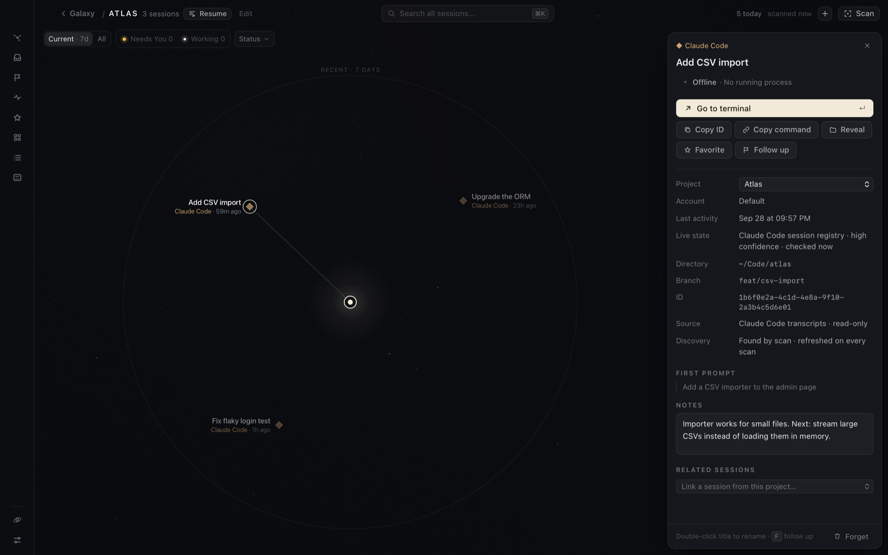

# Hoku

**Your AI work, mapped.**

A local macOS app for AI work that's scattered across Claude Code terminals, Codex Desktop
threads and Claude Desktop conversations. It organizes them as **projects → sessions** on a
constellation map, shows what's waiting on you, finds any session with ⌘K, and takes you back
to the exact conversation in its own app.

**📖 User guide: <https://joao-afonso-p.github.io/hoku/>**


> **Hoku does not replace Claude or Codex. It indexes and launches sessions in
> their native tools.**

**Platform:** macOS only. Releases are built for Apple Silicon Macs; on an Intel Mac,
[build it from source](#running). Linux and Windows are not supported: opening sessions relies
on AppleScript, iTerm/Terminal and macOS app bundles. Hoku is pre-1.0.

## Installing

Hoku is published on [GitHub Releases](https://github.com/joao-afonso-p/hoku/releases). Install
it once and it stays in Applications like any other app. To install, or to update to the
latest release, run this in Terminal:

```bash
curl -fsSL https://raw.githubusercontent.com/joao-afonso-p/hoku/main/scripts/install.sh | bash
```

The [script](scripts/install.sh) downloads the latest DMG, checks its SHA-256, installs
`/Applications/Hoku.app` (quitting and replacing an older copy), and opens it. Your index in
`~/Library/Application Support/com.hoku.app` is never touched.

**To update,** run the same command again whenever a new version is released.

**Options** go after `bash -s --`, for example `| bash -s -- --version v0.2.0`:

| Option | Effect |
|---|---|
| `--version vX.Y.Z` | Install that release instead of the latest |
| `--dir ~/Applications` | Install for your user only, if you can't write to `/Applications` (the folder must exist) |
| `--dmg FILE` | Install a DMG you already downloaded (checked against a `SHA256SUMS.txt` next to it) |
| `--no-open` | Don't open Hoku after installing |

**Or by hand:** download `Hoku_<version>_aarch64.dmg` from the latest release, open it, and drag
Hoku to Applications. Hoku is free and isn't notarized by Apple, so the first time you open it
you approve it once in **System Settings → Privacy & Security → Open Anyway**. The
[install guide](https://joao-afonso-p.github.io/hoku/start/install/) walks through it, and
covers verifying a download and what changes on update.

## What it does

- **Galaxy.** Every project is a star system and its sessions orbit it: angle = provider,
  distance = relevance, halo = state. [Guide](https://joao-afonso-p.github.io/hoku/guides/galaxy/)
- **Live status and Needs You.** Every session is *working*, *needs you*, *ready*, *idle*,
  *offline*, *error* or *unknown*, with an honest confidence. Needs You is the inbox for
  permissions, questions and sign-ins, with an optional Dock badge and notifications.
  [Guide](https://joao-afonso-p.github.io/hoku/guides/needs-you/)
- **Go to terminal.** One action takes you back: it switches to the iTerm/Terminal tab (or VS
  Code) a Claude Code session runs in, attaches, or resumes it. Codex and Claude sessions open
  in their apps. [Guide](https://joao-afonso-p.github.io/hoku/guides/opening-sessions/)
- **⌘K** searches every session, project and action.
  [Guide](https://joao-afonso-p.github.io/hoku/guides/search/)
- **Follow up**, your own review-later queue with reminders.
  [Guide](https://joao-afonso-p.github.io/hoku/guides/follow-up/)
- **Project Resume**: click a project's core to see where to continue, what needs a decision and
  what changed, or start a new Claude Code session in the project's folder (or one you pick).
  Optional AI drafts through your Claude Code CLI. [Guide](https://joao-afonso-p.github.io/hoku/guides/resume/)
- **Recaps**: a public-safe, shareable summary of a period, with outcomes you write.
  [Guide](https://joao-afonso-p.github.io/hoku/guides/recaps/)
- **Activity**, **Sessions**, **Favorites**, **Projects**, manual add for Claude chats, and
  **Forget** to drop a session from Hoku without touching the provider's copy.



## Local-first

- No account, no cloud, no backend, no analytics, no telemetry. Hoku makes no network requests
  itself. For account status it runs the providers' own CLIs (`claude auth status`,
  `codex login status`), which may contact their own servers.
- Claude and Codex data is **read** from this Mac, strictly read-only. No passwords or tokens
  are read or stored. Full transcripts are never indexed: a title, a ≤200-character preview,
  a short runtime detail and metadata per session.
- One opt-in exception: **AI drafts** in Project Resume, off by default, sent only when you
  click **Generate draft**, with a payload you inspect first.
- Everything lives in `~/Library/Application Support/com.hoku.app/hub.sqlite`, on this Mac.

Details: [How Hoku handles your data](https://joao-afonso-p.github.io/hoku/privacy/).

## Providers

| Provider | Discovery | Live state | Opening |
|---|---|---|---|
| **Claude Code** | Transcripts in `~/.claude/projects` + the live-session registry | **Full** | Go to terminal: switch to its tab, attach, or `claude --resume` |
| **Codex Desktop** | Thread index `~/.codex/state_*.sqlite` (read-only) | **Partial**, approvals inferred | `codex://threads/<id>` |
| **Claude Desktop, Cowork** | Local session metadata | **Limited** | `claude://claude.ai/local_sessions/<id>` |
| **Claude Desktop, chats** | **Manual only** (chats live on claude.ai) | **None** | `claude://claude.ai/chat/<uuid>` |

Per-provider details and limits are in the guide's
[provider pages](https://joao-afonso-p.github.io/hoku/providers/) and
[known limitations](https://joao-afonso-p.github.io/hoku/reference/limitations/). The
investigation behind each integration is in [docs/provider-discovery.md](docs/provider-discovery.md).

## Running

Requirements: macOS, Xcode Command Line Tools, Node 22.12+, pnpm 10, Rust (`rustup`).

```bash
pnpm install
pnpm tauri dev          # run in development
pnpm tauri build        # build Hoku.app → src-tauri/target/release/bundle/macos/
pnpm test               # layout, visibility, runtime status, filter, search tests (vitest)
cd src-tauri && cargo test   # parsers, merge rules, runtime mapping + watchdog, launch safety (Rust)
cd src-tauri && cargo test probe_this_mac -- --ignored --nocapture   # runtime state of real sessions, in memory
```

### Installing locally (optional)

To use Hoku as a regular app, install a release build into `/Applications/Hoku.app`
(writing there may need admin rights). `pnpm tauri dev` is only for development, and release
builds left in `src-tauri/target/` are just build output.

```text
make changes → pnpm install:local → use /Applications/Hoku.app
```

`pnpm install:local` (or `./scripts/install-local.sh`):
1. Builds the release version and checks the bundle is `Hoku` / `com.hoku.app`.
2. Quits an installed Hoku if it's running. It does this cleanly, never force-kills, and never
   touches `tauri dev`.
3. Moves the new bundle into `/Applications` and unregisters its build-folder path, putting the
   previous install back if the swap fails. Moving rather than copying means no second Hoku.app
   is left in `src-tauri/target/` to show up as a duplicate in Spotlight or Launchpad. For the
   same reason, prefer `pnpm install:local` over a bare `pnpm tauri build`.
4. Re-registers it with macOS, relaunches it, and reports the result.

Your index (`~/Library/Application Support/com.hoku.app/hub.sqlite`) is outside the bundle
and is never touched. The script compares its project and session counts before and after,
and fails loudly if they differ. `--no-build` reinstalls the last build; `--no-open` skips
launching it.

**Demo data:** Settings → Load demo adds three clearly labelled demo systems for density
testing. They can't be opened, and "Remove demo data" deletes them.

## Architecture

Tauri 2 (Rust) + React 19 + TypeScript + Tailwind v4 + SQLite (rusqlite). The constellation
is a custom SVG renderer with a deterministic layout.

**Brand assets:** `assets/logo.png` is the canonical logo: the rounded tile with the orbit
mark, and no wordmark ("Hoku" is always set as text beside it). `src-tauri/icons/app-icon.png`
is derived from it:
1. The tile is cut out with an anti-aliased rounded mask (radius 222 px at source scale) that
   keeps its highlighted border and drops the painted shadow, since macOS adds its own.
2. It's fitted at its true aspect ratio into Apple's 1024 px canvas with the standard 100 px
   margin.
3. `pnpm tauri icon src-tauri/icons/app-icon.png` expands it to every size.

`src/assets/hoku-mark-{96,256}.png` are the same tile without the icon margin, used in the
UI. The app is named **Hoku** everywhere: `productName`, the `Hoku` executable
(so the Dock label is right even in `tauri dev`), and `Hoku.app`, with bundle id
`com.hoku.app`.

- [docs/architecture.md](docs/architecture.md): modules, data model, merge rules, security
- [docs/constellation-layout.md](docs/constellation-layout.md): positioning algorithm and
  stability guarantees
- [docs/provider-discovery.md](docs/provider-discovery.md): where each provider stores its data
  and why each integration works the way it does
- [docs/releasing.md](docs/releasing.md): how versions and releases are cut (automatically,
  after merges), built, installed, verified and tested on a clean machine
- [site/](site/README.md): the user guide published at <https://joao-afonso-p.github.io/hoku/>

## Contributing

See [CONTRIBUTING.md](CONTRIBUTING.md) for setup, the provider adapter architecture and the
checks to run before a pull request. Report security issues privately as described in
[SECURITY.md](SECURITY.md). Participation is governed by the
[Code of Conduct](CODE_OF_CONDUCT.md).

## License

[MIT](LICENSE) © 2026 João Afonso
