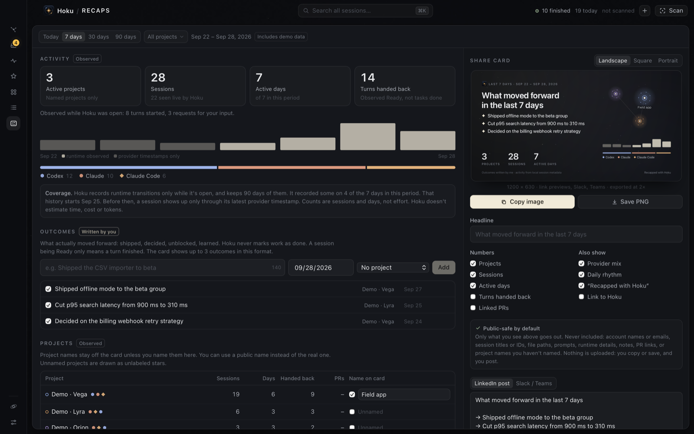
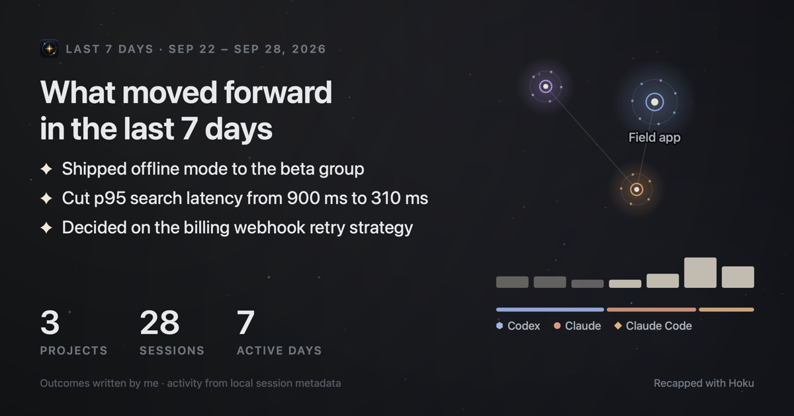

# Recaps

Recaps summarise a period of AI-assisted work: what moved forward, and the activity behind
it. You can share one as an image or as text on LinkedIn, Slack or Teams. The recap is
built for honesty first. Everything on it is either something Hoku observed locally or
something you wrote yourself, and the card says which is which.

Open it from the rail (the card icon under Sessions) or with ⌘K → *Show Recaps*.

## What's in a recap

Choose a period (Today, 7, 30 or 90 days, always ending now) and optionally some projects.

| Part | Source | Label in the app |
|---|---|---|
| Active projects, sessions, active days | Provider timestamps (`sessions.last_activity_at`) plus Hoku's runtime history (`activity_events`) | Observed |
| Daily activity | Distinct sessions per local day. Bright bars are days Hoku recorded runtime transitions; dim bars come from provider timestamps only | Observed |
| Provider mix | Sessions per provider | Observed |
| Turns started, turns handed back, requests for input | `started_working`, `became_ready` and `needs_input` transitions | Observed while Hoku was open |
| Linked pull requests | The `prUrl` Claude Code records in a session. Hoku doesn't know whether a PR merged | Observed |
| Outcomes | One-line milestones **you** write, dated, optionally tied to a project | Written by you |

A session counts as active in the period when its provider reported activity then, or the
runtime monitor saw it change state then. Because a period always ends now, a session's
latest provider timestamp is enough to know it was active at some point in it.

### What a recap never claims

- **Ready isn't done.** `became_ready` means an agent finished its turn and handed back.
  It's shown as "turns handed back", is off on the card by default, and never counts as a
  completed task. Only outcomes you write say that something moved forward.
- No cost, hours saved, productivity scores, completion rates or token totals. Codex
  reports tokens and the other providers don't, so no cross-provider total would be honest.
- The numbers are per session and per day. How often a session changed state never adds
  to the headline numbers, so churn can't pad a recap.

### Coverage

Runtime transitions are recorded only while Hoku is open, and kept for 90 days. A recap
can't be longer than that. Every recap shows a coverage note: how many days in the period
had any runtime history, and where that history starts. Before that point a session shows
up only through its latest provider timestamp.

The recap comes from its own bounded query (`recap::build`), not from the snapshot, which
holds only the last 30 days of events capped at 600. Events are grouped per session, day
and type in SQL, so a busy period is counted completely.

## Outcomes

Outcomes live in Hoku's own database (`recap_outcomes`, migration v4): up to 140
characters, a local date and an optional project. They're listed in every recap whose
period and projects include them. You pick which ones go on the card: by default the newest
3 (landscape), 4 (square) or 5 (portrait). Deleting a project keeps its outcomes, which
become project-less. *Remove demo data* deletes outcomes tied to demo projects.

The linked-PR list can pre-fill an outcome ("Pull request #42: "), which you then finish
in your own words. The repository name and link aren't copied.

## Sharing

The share card is drawn with Canvas 2D (`src/features/recaps/card.ts`). The same renderer
draws the preview and the export, so what you see is what you share. Formats:

- **Landscape** 1200 × 630: link previews, Slack, Teams
- **Square** 1080 × 1080: the LinkedIn feed
- **Portrait** 1080 × 1350: LinkedIn on mobile

PNGs are exported at 2×. Text is sized to stay readable when a feed shows the image at
about half width: headlines of 48 to 66 units, outcomes of 27 to 32.

- **Copy image** puts a PNG on the clipboard (`NSPasteboard`), ready to paste into a post
  or chat.
- **Save PNG** writes `Hoku recap YYYY-MM-DD.png` to `~/Downloads`. It never overwrites an
  existing file and offers *Show in Finder*.
- **Copy text** copies a LinkedIn post (plain text, since LinkedIn doesn't render Markdown)
  or a Slack/Teams message. Both are built from the same content as the card, and you can
  edit them before copying.

Nothing is uploaded or posted automatically. Hoku still makes no network requests.

### Privacy defaults

The card and the text are built only from the recap's aggregates and your own words
(`buildCard` in `src/features/recaps/share.ts`). These are never included: account names
or emails, session titles or IDs, paths, prompts, runtime details, notes and PR links. A
project's name appears only after you tick *Name on card*. You can give it a public name
first. Unsorted is never named. The subtle "Recapped with Hoku" line can be turned off,
and the Hoku repository link is off unless you add it. Your choices (format, numbers,
project labels, attribution) are saved in the `recaps.share` setting.
