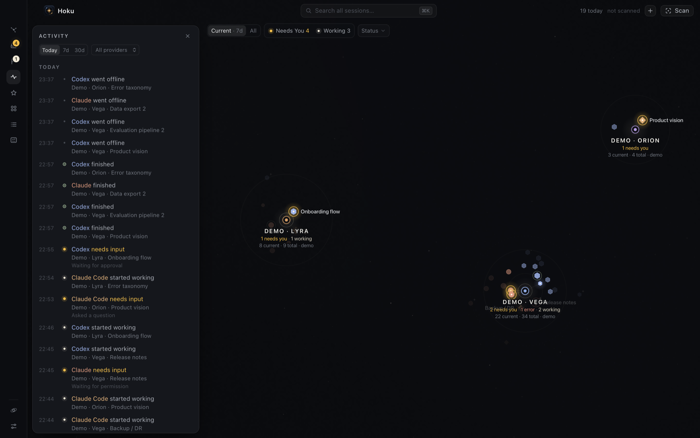

**Activity** in the rail is a timeline across all providers: which sessions started working, needed you, finished, failed, stopped or went offline.

- Choose **Today**, **7d** or **30d**, and optionally one provider.
- Events are grouped by day, newest first. Needs-input and error events show the reason.
- Click a row to show the session on the map. Double-click to open it.
- Hover a row and click the flag to put that session in [Follow up](/hoku/guides/follow-up/).

**N finished** in the top bar counts sessions that finished a turn since you last opened Activity. Opening Activity marks them seen, and they're tagged *new* while the drawer is open. Finishing is news, not a task, so it's never a badge.

## What is recorded

Hoku records *changes of state*, not what the session did:

| Event | When |
|---|---|
| started working | a turn began (or *resumed*, after waiting on you) |
| needs input | it started waiting on you |
| finished | it finished its turn (Ready) |
| hit an error | the turn failed |
| stopped | it went idle while working or waiting |
| opened | it came back from offline |
| went offline | its process ended |
| added | you added it by hand |

- Individual tool calls, prompts and output are never recorded.
- The same event for one session within 2 minutes is recorded once.
- Events are kept for 90 days.
- Events are recorded **only while Hoku is running**. What happened while Hoku was closed isn't in the timeline, although each session's last activity time still comes from the provider.

The same history feeds *What changed* in [Resume](/hoku/guides/resume/) and the counts in [Recaps](/hoku/guides/recaps/).
