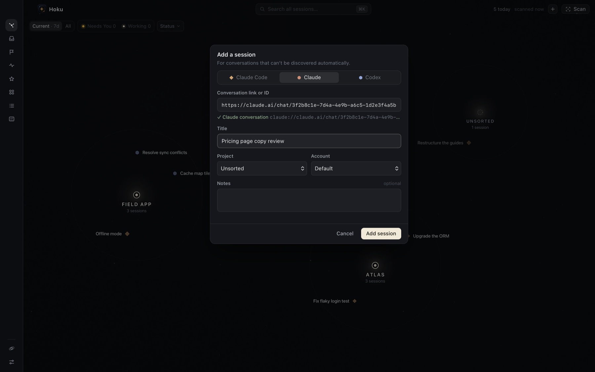

import { Steps } from "@astrojs/starlight/components";

Scans find Claude Code, Codex and Cowork sessions on their own. **Claude Desktop chats** are the exception: they live on claude.ai, not on your Mac, so Hoku can only know about a chat you add yourself. You can also add any Claude Code or Codex session by ID.

**Open it:** the **+** in the top bar, <kbd>⌘</kbd><kbd>N</kbd>, *Add session manually* on the first screen, or in <kbd>⌘</kbd><kbd>K</kbd>. If you're inside a project, the session goes into that project by default.

<Steps>

1. Pick the provider: **Claude Code**, **Claude** or **Codex**.

2. Paste the reference. Hoku checks it as you type and shows a green check when it recognizes it:

   | Provider | Accepts |
   |---|---|
   | **Claude** (Desktop chats) | a web link `https://claude.ai/chat/…`, a `claude://` link, or the chat's ID |
   | **Codex** | a thread ID, or a `codex://threads/…` link |
   | **Claude Code** | a session ID, or a whole `claude --resume <id>` command |

3. Give it a **Title**. Claude chat titles live on claude.ai, so Hoku can't read them.

4. For Claude Code, enter the **Working directory**. That's where it will be resumed.

5. Optionally choose a **Project**, an **Account** label and **Notes**, then click **Add session**.

</Steps>

Hoku shows the new session on the map with its inspector open. A chat you add keeps working like any other session: search, favorites, follow-ups, notes, Resume. Chats have no live state, so they're always *Unknown* and never appear in Needs You.

To get a chat's link in Claude Desktop or on claude.ai, open the chat and copy the address from the browser, or use Claude's share or copy-link options.

If you add a session that you had [forgotten](/hoku/guides/cleaning-up/#forget-a-session), it comes back, and scans stop leaving it out.
