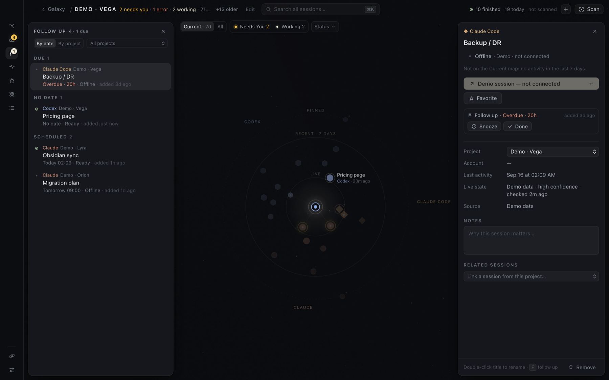

Follow up is your own list of sessions to come back to: a finished turn you want to review, a branch to check tomorrow, a thread to pick up on Monday. It's separate from [Needs You](/hoku/guides/needs-you/). Needs You is what a provider is blocked on. Follow up is only what **you** put there.

Nothing lands in Follow up on its own. Scans and live status never add, change or clear it.

## Follow up or Favorite?

Both are yours alone, and both keep an old session on the Current map. They differ in how they end:

- **Follow up** is a to-do. You add a session to come back to it once, optionally at a set time, and mark it **Done** when you have. The list is meant to empty.
- **[Favorite](/hoku/guides/sessions/#favorites)** is a bookmark. It's for sessions you keep returning to, like a project's main thread, and it has no dates and nothing to finish.

A session can be both.

## Add a session

Any of these:

- Select a session and press <kbd>F</kbd>.
- Click **Follow up** in its inspector.
- Hover a row in [Activity](/hoku/guides/activity/) and click the flag.
- Hover a row in the Sessions table and click **Follow up**.
- Press <kbd>⌘</kbd><kbd>F</kbd> on a result in <kbd>⌘</kbd><kbd>K</kbd>.

Hoku confirms with **Added to Follow up** and an **Undo**.

## Set a reminder

A session can wait with no date, or with a reminder. Use **Remind me** in its inspector, or the clock on its row in the Follow up drawer:

- **In 3 hours**
- **Tomorrow**, at 9:00
- **Next week**, Monday at 9:00
- a date and time you pick, then **Set**
- **No date, just later**, or **Remove reminder**.

Once a reminder has gone off, the session is **due**. The Follow up badge in the rail counts due sessions. Reminders from an earlier day show as **Overdue**, in coral. Use **Snooze** to push one back.

Reminders show inside Hoku only: the rail badge, the drawer and the inspector. Hoku doesn't send macOS notifications for them.

## The Follow up drawer

- **By date** groups it into **Due** (longest overdue first), **No date** (in the order you added them) and **Scheduled** (soonest first).
- **By project** groups it by project. With several projects, a menu filters to one.
- Each row shows the reminder, the session's live state, and when you added it, or *opened since* if you've opened the session after adding it. That's a hint you may be done.
- Hover a row for **Remind me later**, **Done** and **Open**.

## Mark it done

Press <kbd>F</kbd> again on the selected session, or click **Done**. Hoku says **Done. Removed from Follow up**, with **Undo** to put it back exactly as it was.

Sessions in Follow up stay on the Current map even when they're old, so you can find them where you left them. [Forgetting](/hoku/guides/cleaning-up/#forget-a-session) a session also removes its follow-up.
