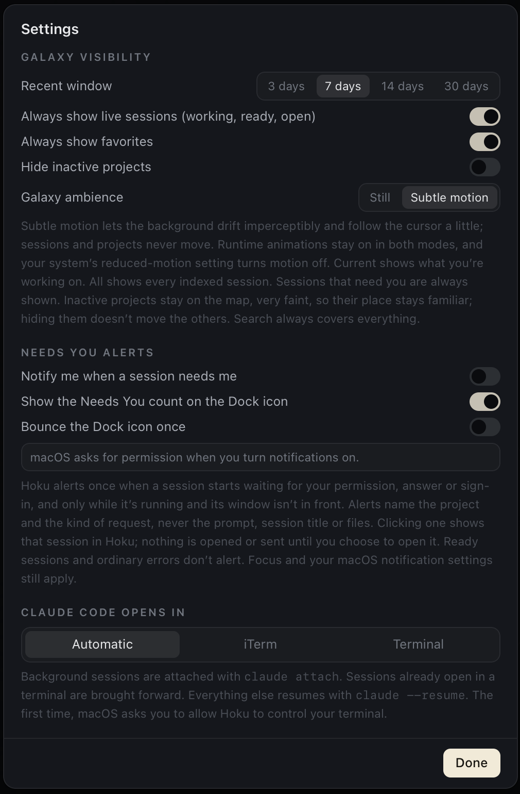

Hoku watches every session and gives each one a live state. It checks every 4 seconds, and again as soon as you switch back to Hoku. **Needs You** is built on top of that: it's the list of sessions that can't go on without you.

## The states

| State | Meaning |
|---|---|
| **Needs You** | Blocked on you: a permission prompt, a question, a plan to approve, a confirmation, or a sign-in. |
| **Error** | The last turn failed, for example a usage limit or a failed request. An error that you must fix, such as *Authentication required*, counts as Needs You. |
| **Working** | Generating or running tools right now. |
| **Ready** | Finished its turn recently and is waiting for your next prompt. After 45 minutes it becomes Idle. |
| **Idle** | Open, nothing happening. |
| **Offline** | No running process. |
| **Unknown** | The provider doesn't expose live state, so Hoku can't tell. |

**Ready doesn't mean done.** It only means the agent handed the turn back to you. Hoku never marks work as finished. To come back to a finished session later, put it in [Follow up](/hoku/guides/follow-up/).

A few rules keep states believable:

- A session that says it's working but shows no activity for 20 minutes becomes Unknown.
- An error without follow-up activity quiets down to Idle after 6 hours.
- Needs You has no timeout. It stays until the provider clears it: you answered, the session stopped, or its process went away.

### How sure Hoku is

Each state has a confidence. When a provider reports a state itself, it's shown plainly. When Hoku had to infer it, it's marked: the inspector says *Inferred from local metadata*, and lists show **Likely:** before the reason.

How much each provider lets Hoku see:

| Provider | Live state | What Hoku can see |
|---|---|---|
| Claude Code | **Full** | Claude Code's own live-session registry reports busy, waiting (and on what) and idle. The transcript's tail names the tool or question. |
| Codex Desktop | **Partial**, inferred | Codex doesn't record approval requests, so Hoku infers them from commands still waiting for an answer. |
| Claude Desktop, Cowork | **Limited** | Only whether Claude Desktop is running and when the session last changed. Never Needs You. |
| Claude Desktop, chats | **None** | Nothing is on this Mac. Always Unknown. |

The [provider pages](/hoku/providers/) explain the details and gaps.

## The Needs You inbox

Click **Needs You** in the rail. The amber badge shows how many sessions need you.

- Sessions that must be fixed (such as a sign-in) come first, then the longest wait.
- Each row shows the provider, project, title, the reason ("Waiting for permission"), the detail ("Bash", or the question asked) and how long it has waited.
- Click a row to see the session on the map with its inspector. Double-click it, or hover and click **Open**, to go straight to it.

Only real blocks land here. Finished sessions are Ready and show up in [Activity](/hoku/guides/activity/). Needs You clears itself when the provider reports the session is no longer waiting.

The same rule drives the badge, the inbox, the **Needs You** quick filter on the Galaxy, and the Dock badge. They always agree.

## Alerts and the Dock

Open **Settings → Needs You alerts**:

| Setting | Default | What it does |
|---|---|---|
| **Notify me when a session needs me** | Off | A macOS notification when a session **starts** needing you |
| **Show the Needs You count on the Dock icon** | On | The same number as the rail badge, on Hoku's Dock icon |
| **Bounce the Dock icon once** | Off | One bounce, never the repeating kind |

How alerts behave:

- **Once per wait.** A session alerts when it starts needing you. It doesn't alert again while it keeps waiting, or when the reason changes. When it stops waiting, its notification is removed from Notification Center.
- **Not while you're looking.** No notification or bounce while Hoku's window is in front. If Hoku is minimized, hidden or behind another app, alerts go ahead.
- **No backlog.** Opening Hoku doesn't replay alerts for sessions that were already waiting.
- **Quiet repeats.** A session that comes back within 60 seconds of being answered doesn't alert again. More than three sessions at once become one "N sessions need you" notification.
- **Only real blocks.** Ready sessions and ordinary errors never alert.

**What a notification shows.** Only the project name and the kind of request, for example *Claude Code · Waiting for permission*. Never the session title, prompt, detail, files or account. Notifications can appear on the lock screen, so this is deliberate.

**Clicking a notification** brings Hoku forward and shows that session with its inspector open. Nothing is opened in the provider app until you choose to. If the session is gone, Hoku opens the Needs You inbox.

**Limits.** Hoku posts notifications itself, so they only arrive **while Hoku is running**. Nothing is pushed from a server. Focus modes and your settings in **System Settings → Notifications → Hoku** still apply. If macOS doesn't show the Dock number, check *Badge application icon* there. Hoku asks for notification permission the first time you turn one of these on, and Settings says so if permission is off.
