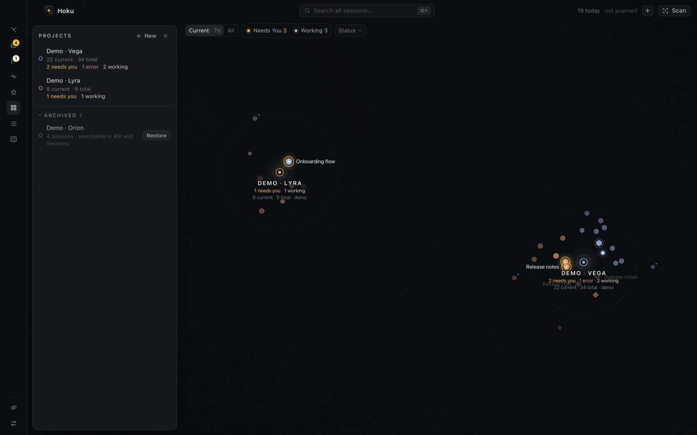

A project groups the sessions that belong together, usually one repository or folder. Every session is in exactly one project, or in **Unsorted**.

## Where projects come from

- **From a scan.** After a scan, Hoku suggests projects from the folders your sessions ran in, and from projects you created in Codex. See [First run](/hoku/start/first-run/#scan-this-mac).
- **By hand.** Click **Create project** on the first screen, **New** in the Projects drawer, or search for *Add project* in <kbd>⌘</kbd><kbd>K</kbd>.

## Create or edit a project

A project has:

- a **Name**
- an optional **Root folder**, such as `~/Projects/atlas`
- an **Accent** color, used for its ring on the map.

To edit a project, focus it and click **Edit** in the top bar, or use the pencil in the Projects drawer.

## How sessions join a project

When a session's folder is inside a project's root folder, it joins that project automatically, now and on every later scan. Linked Git worktrees count as the main repository. Sessions that match no project go to **Unsorted**.

Each project has **one** root folder. For a session that ran somewhere else, move it by hand:

- in the session's inspector, choose a project from **Project**
- on the map, drag the session onto another project.

Your choice sticks. Scans never move a session you placed yourself.

## The Projects drawer

Click **Projects** in the rail. Each row shows "N current · M total" and a status summary such as "1 needs you · 2 working". Click a name to zoom into the project. Hover a row for three shortcuts:

- **Resume**: open the project's [Resume](/hoku/guides/resume/).
- **Archive**: take it off the Galaxy and keep everything.
- **Edit**: name, folder and accent.

Archived projects are listed under **Archived** at the bottom, with **Restore**. See [Archive, delete and forget](/hoku/guides/cleaning-up/) for the difference between archiving and deleting a project.

## Unsorted

Unsorted collects sessions that don't belong to any project yet. It's drawn with a dashed ring and has no settings of its own. It disappears when it's empty.
