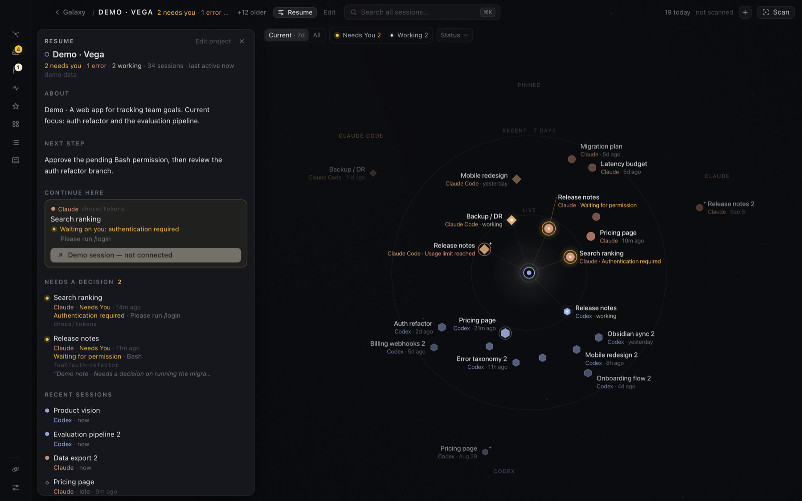

import { Steps } from "@astrojs/starlight/components";

Resume answers "where was I?" for one project: what it is, where to pick up, what's waiting on you, and what changed recently.

**Open it:** zoom into a project and click **Resume** in the top bar or press <kbd>R</kbd>. You can also use the Resume icon in the Projects drawer, or *Resume this project* in <kbd>⌘</kbd><kbd>K</kbd>. Press <kbd>R</kbd> again or <kbd>Esc</kbd> to close it.

## What's in it

- **About**: a sentence or two about the project, in your words. Click it to edit. <kbd>⌘</kbd><kbd>↵</kbd> saves, <kbd>Esc</kbd> cancels. Up to 600 characters.
- **Next step**: a note to future you about where to pick up. Up to 280 characters. [Forgetting a session](/hoku/guides/cleaning-up/#forget-a-session) can save its note here.
- **Continue here**: the one session to open first, and why. Hoku picks, in order:
  1. a session that needs you
  2. one that's working right now
  3. one that finished its turn and is ready
  4. one whose last turn failed
  5. otherwise, the most recently active.

  The button under it opens that session.
- **Needs a decision**: every session in the project that's waiting on you, with the reason and detail.
- **Recent sessions**: the five most recent (**Show more** for the rest), each with state, branch, pull request number, linked sessions and your note.
- **What changed · last 7 days**: recorded events such as "finished its turn" or "needed you", from [Activity](/hoku/guides/activity/).
- **From your notes**: the notes you've written on the project's sessions.

*Ready* means an agent finished its turn, not that the task is done. Inferred states are marked as inferred.

Resume is built from what's already in Hoku. Nothing leaves your Mac unless you use an AI draft.

## AI drafts (optional)

If you'd rather not write **About** and **Next step** yourself, Claude can draft them through the Claude Code CLI you already have installed. It's **off by default**, never automatic, and Resume works fully without it.

### Turn it on

<Steps>

1. Open **Settings → AI drafts · optional**. Hoku checks that the Claude Code CLI is installed, is new enough, and is signed in.
2. Turn on **Let Claude draft project descriptions in Resume**. Hoku lists exactly what a draft sends and never sends. Click **Turn on AI drafts** to confirm.

</Steps>

### Make a draft

<Steps>

1. In a project's Resume, click **Draft with Claude…** next to About.
2. Hoku shows **the exact text that will be sent**: the instructions and the project data. Read it.
3. Click **Generate draft**. It usually takes a few seconds, and gives up after two minutes.
4. Edit the draft if you like, then click **Use draft** to save it, or **Discard**. Nothing is saved until you accept.

</Steps>

### What is sent, and what isn't

A draft sends:

- the project name, and the description and next step you wrote
- titles and states of up to 8 of the project's most relevant sessions, with branch names and PR numbers
- your notes on those sessions
- up to 12 recent activity events from the last 14 days (for example "finished its turn").

**Never sent:** transcripts, prompts, tool output, file contents, folder paths, links, email addresses, account details or session IDs. Paths, links, emails and token-like strings inside titles and notes are replaced before sending.

**How it runs.** Hoku runs the Claude Code CLI on this Mac once, as a single one-off request:

- It uses the CLI's own sign-in, so the draft counts against your Claude plan.
- Every tool is disabled.
- Your customizations are off: no CLAUDE.md, hooks, plugins or MCP servers.
- No Claude session is saved.

Hoku never reads or stores your credentials. This is the only feature in Hoku that sends anything over the network, and only when you click **Generate draft**. See [How Hoku handles your data](/hoku/privacy/#the-one-exception-ai-drafts).

If AI drafts aren't available, Settings says why: the CLI isn't installed, is too old (update it), or is signed out (run `claude auth login` in a terminal).
