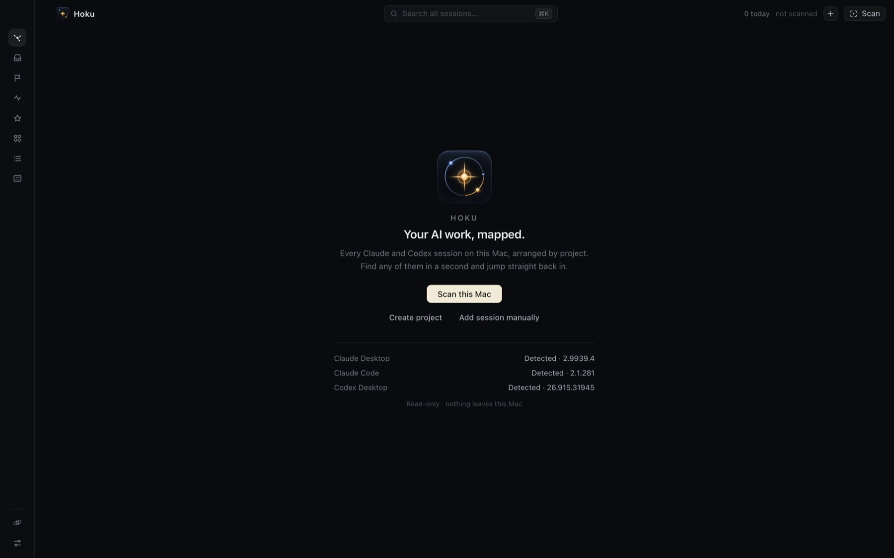

import { Steps } from "@astrojs/starlight/components";

The first time you open Hoku, it's empty. It hasn't read anything yet.

The list at the bottom shows which provider apps Hoku found on this Mac. It checks for the apps and command-line tools only, without opening any of their data.

## Scan this Mac

<Steps>

1. Click **Scan this Mac**, or press <kbd>⌘</kbd><kbd>⇧</kbd><kbd>S</kbd> at any time later.

   Hoku reads, read-only:
   - Claude Code transcripts in `~/.claude/projects`
   - the Codex Desktop thread index in `~/.codex`
   - Claude Desktop's local Cowork session metadata.

   It never changes those files.

2. Read the result. Each source reports how many sessions it found and how many are new. *Not found on this Mac* just means you don't use that app. Claude Desktop chats are always *Manual only*, because they live on claude.ai (see [Adding sessions by hand](/hoku/guides/adding-sessions/)).

   

3. Under **Suggested projects**, pick the folders you want as projects. Suggestions come from the folders your sessions ran in, and from projects you created in Codex. Folders with two or more sessions are ticked for you. You can rename a suggestion before creating it.

4. Click **Create projects**. Sessions whose folder is inside a project's folder join it. Everything else goes to **Unsorted**, which you can sort out later.

</Steps>

After the first scan, the [Galaxy](/hoku/guides/galaxy/) shows your projects. Scan again whenever you like. Hoku also notices new Claude Code sessions on its own while it's running.

## Try it with demo data first

If you'd rather look around before scanning, open **Settings → Demo data** and click **Load demo**. Hoku adds three clearly labeled demo projects (*Demo · Vega*, *Demo · Lyra*, *Demo · Orion*) with sessions in every state. Demo sessions can't be opened. **Remove demo data** deletes all of them, including anything you wrote about them.

## Permissions macOS will ask for

Hoku asks for nothing at launch. You'll see these prompts only when you use the feature that needs them:

| When | macOS asks | Why |
|---|---|---|
| The first time you use **Go to terminal** | *"Hoku wants to control iTerm"* (or Terminal) | To switch to the tab a Claude Code session runs in, or to open a new one. Asked again after each update. |
| When you turn on notifications or the Dock badge in Settings | Whether Hoku may send notifications | For [Needs You alerts](/hoku/guides/needs-you/#alerts-and-the-dock). |

Hoku doesn't ask for Full Disk Access, Accessibility or Screen Recording.

## Next

- [A tour of Hoku](/hoku/start/tour/): what each part of the window does.
- [Projects](/hoku/guides/projects/): add a root folder so future sessions land in the right place.
